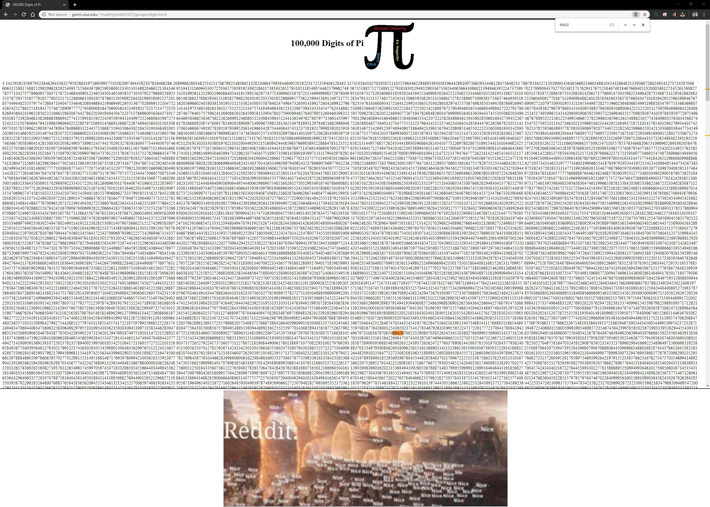
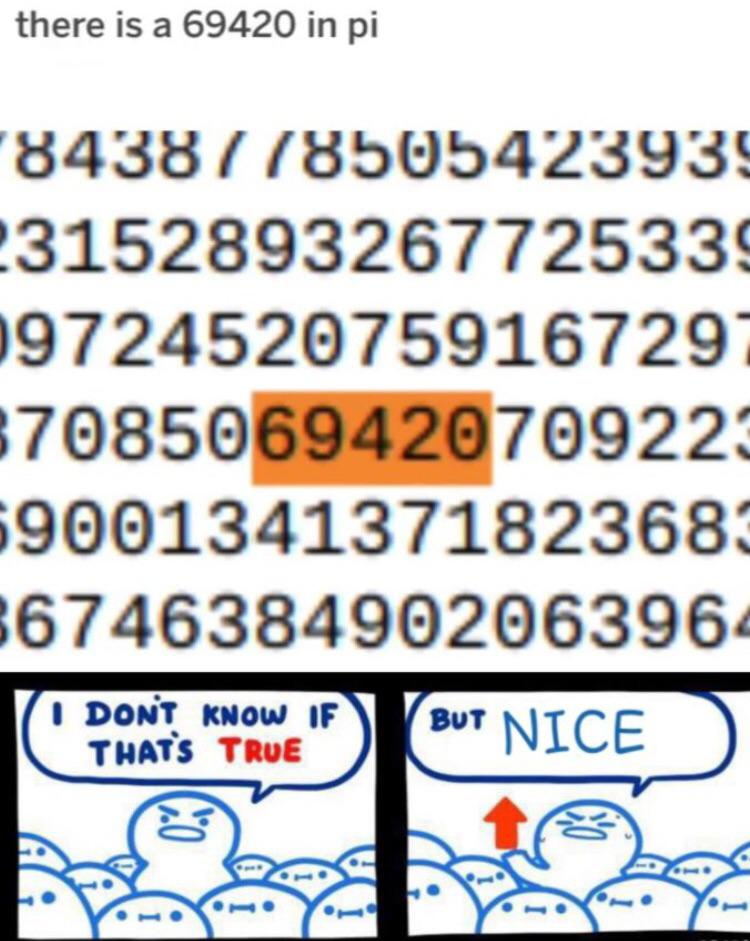

# Pi 69420 Benchmark - Performance Tester

[](https://python.org)
[](LICENSE)
[](README.md)

A high-performance benchmark tool that searches for multiple occurrences of the pattern "69420" within the decimal digits of Pi. This tool measures and reports detailed performance metrics including calculation speed, search efficiency, and discovery rates.

## 🎭 About This Project

**Full disclosure**: I was being kinda lazy, so while the code is entirely mine, the current documentation you're reading was commented and written by AI (as is the docstrings in the code) (though I reviewed it all). This whole thing started when I saw a meme about how Pi contains the sequence "69420" somewhere in its infinite digits - and since Pi is infinite, it actually contains infinite occurrences of 69420! That silly realization drove me to create this equally silly project.

The inspiration came from [this classic Reddit discussion](https://www.reddit.com/r/teenagers/comments/b11ht9/there_is_a_69420_in_pi/) from 7 years ago (but the memes are still valid). Sometimes the best projects come from the most ridiculous internet conversations. I've even included the original memes in the repo for posterity!

<div align="center">
   
</div>

This was a fun little side project, and I'll likely come back to it later to enhance the documentation, improve code effectiveness and efficiency, and add other improvements. If I have enough free time, I also plan to turn this into a proper **FBM (Fun Benchmark)** - testing RAM capacity (how many 69420's can you fit in memory?), CPU performance (69420's per second), and maybe even GPU acceleration for maximum 69420 discovery rates. But for now, it works and it's fun! My goal is simple: to show the world that there is, indeed, 69420 in Pi. 🥧

*Why 69420? Because math can be fun and memes make everything better.*

## 🎯 Features

- **High-Precision Pi Calculation**: Uses the mpmath library for arbitrary-precision arithmetic
- **Efficient Pattern Matching**: Sliding window algorithm for optimal search performance
- **Real-Time Monitoring**: Live progress updates with colored terminal output
- **Dual Operation Modes**: Target-based (find N occurrences) and time-based (search for X seconds)
- **Cross-Platform Support**: Works on Windows, macOS, and Linux with emoji fallbacks
- **Comprehensive Metrics**: Detailed performance analysis and timing statistics
- **Auto-Dependency Management**: Automatically installs required packages

## 🚀 Quick Start

### Prerequisites

- Python 3.7 or higher
- Internet connection (for automatic dependency installation)

### Installation

1. **Clone or download** the repository:
   ```bash
   git clone https://github.com/Protoncracker/pi-69420
   cd pi-69420
   ```

2. **Run the benchmark** (dependencies will be installed automatically):
   ```bash
   python pi_69420.py
   ```

### Basic Usage

```bash
# Default: Search for 3 occurrences of "69420"
python pi_69420.py

# Search for a specific number of occurrences
python pi_69420.py -n 5

# Run in continuous mode for 30 seconds
python pi_69420.py -c 30
```

## 📖 Usage Examples

### Target-Based Mode

Search for a specific number of pattern occurrences:

```bash
# Find 1 occurrence (fastest)
python pi_69420.py -n 1

# Find 5 occurrences
python pi_69420.py --count 5

# Find 10 occurrences (requires ~500K Pi digits)
python pi_69420.py -n 10
```

**Example Output:**
```
================================================================================
                    BENCHMARK: Searching for 3 occurrences of '69420'
================================================================================
📊 Estimated precision needed: 170,000 digits
⚡ Calculating Pi with high precision...
✅ Pi calculated: 170,010 digits in 2.345s
⚡ Calculation rate: 72,508 digits/sec

🔍 Searching for 3 occurrences of '69420'...
Initial window: 1 ➜ 14 ➜ 141 ➜ 1415 ➜ 14159

⭐ Occurrence #1: '69420' at position 15,773
📍 Context at position 15773: ...198034275822...69420...731658496...

⭐ Occurrence #2: '69420' at position 35,252
📍 Context at position 35252: ...457892341567...69420...893475621...

⭐ Occurrence #3: '69420' at position 51,897
📍 Context at position 51897: ...763294857123...69420...456789234...
```

### Continuous Mode

Run the benchmark for a specific time duration:

```bash
# Run for 10 seconds
python pi_69420.py -c 10

# Run for 1 minute
python pi_69420.py --continuous 60

# Run for 5 minutes
python pi_69420.py -c 300
```

**Example Output:**
```
================================================================================
                     Pi 69420 Benchmark - Continuous Mode
================================================================================
⚙️ Algorithm: Incremental digit-by-digit calculation
📚 Library: mpmath (incremental precision)
🔍 Window: 5 sliding digits in real time
⏱️ Duration: 30 seconds

⚡ Calculating Pi digit-by-digit for 30 seconds...

🔍 Calculating Pi in real time with mpmath...
Pi in real time: 1 ➜ 14 ➜ 141 ➜ 1415 ➜ 14159

⭐ Occurrence #1: '69420' at position 15,773
📍 Context at position 15773: ...198034275822...69420...731658496...

⏰ Time limit reached: 30s
```

## 🎛️ Command Line Options

| Option | Description | Default | Range |
|--------|-------------|---------|-------|
| `-n, --count N` | Number of "69420" occurrences to find | 3 | 1-250 |
| `-c, --continuous SECONDS` | Run in continuous mode for X seconds | None | 1-3600 |
| `-h, --help` | Show help message and examples | - | - |

### Option Details

- **Target Mode (`-n`)**: Searches until the specified number of occurrences are found
- **Continuous Mode (`-c`)**: Searches for a fixed time duration, reporting all findings
- **Limits**: Maximum 250 occurrences or 3600 seconds (1 hour) to prevent system overload

## 📊 Performance Metrics

The benchmark provides comprehensive performance analysis:

### Timing Metrics
- **Pi Calculation Time**: Time spent computing Pi digits
- **Sequential Search Time**: Time spent searching for patterns
- **Total Time**: Combined calculation and search time

### Throughput Metrics
- **Digits/Second**: Overall digit processing rate
- **Pi Calculation/Second**: Pi computation efficiency
- **Search Digits/Second**: Pattern search efficiency
- **Occurrences/Second**: Pattern discovery rate

### Efficiency Metrics
- **Success Rate**: Whether target was achieved
- **Discovery Rate**: Occurrences found per second (continuous mode)
- **Completion Percentage**: Goal achievement (target mode)

## 🔧 Technical Details

### Algorithm

1. **Precision Estimation**: Calculates required Pi precision based on target occurrences
2. **High-Precision Calculation**: Uses mpmath to compute Pi with arbitrary precision
3. **Sliding Window Search**: Efficiently scans digits using a 5-digit sliding window
4. **Pattern Matching**: Compares window contents against "69420" pattern
5. **Real-Time Progress**: Updates progress indicators without impacting performance

### Performance Characteristics

- **Memory Usage**: Scales with Pi precision (typically 1-100MB)
- **CPU Usage**: Single-threaded, computationally intensive
- **Typical Rates**: 10,000-100,000 digits/second (hardware dependent)
- **First Occurrence**: Known to be at position 15,773 in Pi

### Dependencies

The tool automatically manages its dependencies:
- **mpmath**: High-precision arithmetic library
- **colorama**: Cross-platform colored terminal output

## 🎨 Output Features

### Color Coding
- 🟢 **Green**: Success indicators, found patterns
- 🟡 **Yellow**: Warnings, time limits, calculations in progress
- 🔵 **Blue**: Information, configuration details
- 🟣 **Magenta**: Performance metrics
- 🔴 **Red**: Errors, failures

### Emoji Support
- Automatically detects terminal emoji support
- Falls back to ASCII symbols on incompatible terminals
- Enhances readability without affecting functionality

### Progress Indicators
- Real-time digit processing counters
- Live rate calculations (digits/second)
- Pattern discovery notifications
- Time remaining (continuous mode)

## 🐛 Troubleshooting

### Common Issues

**"ModuleNotFoundError: No module named 'mpmath'"**
- The tool automatically installs mpmath, ensure internet connectivity
- Manual installation: `pip install mpmath`

**"UnicodeEncodeError" with emoji**
- Tool automatically falls back to ASCII symbols
- Use a Unicode-compatible terminal for best experience

**Slow performance**
- Performance varies by hardware (CPU speed affects Pi calculation)
- Reduce target occurrences for faster completion
- Use continuous mode for time-limited runs

**Memory usage**
- Memory scales with precision requirements
- Targeting >20 occurrences may require several GB of RAM
- Monitor system resources for large searches

### Performance Tips

1. **Start Small**: Begin with 1-3 occurrences to test performance
2. **Monitor Resources**: Watch CPU/memory usage for large searches
3. **Use Continuous Mode**: For time-constrained testing
4. **Hardware Matters**: Faster CPUs significantly improve performance

## 📋 Known Limitations

- Single-threaded execution (mpmath limitation)
- Memory usage grows with target occurrence count
- Pattern search is case-sensitive ("69420" only)
- Maximum 1 million Pi digits calculated per run

## 📄 License

This project is licensed under the MIT License - see the LICENSE file for details.

## 🤝 Contributing

Contributions are welcome! Please feel free to submit issues, feature requests, or pull requests.

### Development Setup

1. Fork the repository
2. Create a feature branch
3. Make your changes with appropriate tests
4. Submit a pull request

## 📈 Version History

- **v1.0**: Initial release with target and continuous modes
- Comprehensive documentation and type hints
- Cross-platform emoji and color support
- Automatic dependency management

## ❓ FAQ

**Q: Why search for "69420" specifically?**
A: This pattern provides an interesting benchmark case - it's rare enough to require significant computation but common enough to find multiple occurrences within reasonable time.

**Q: How accurate are the Pi calculations?**
A: The tool uses mpmath for arbitrary-precision arithmetic, providing mathematically accurate Pi digits to the specified precision.

**Q: Can I search for other patterns?**
A: Currently, the tool is optimized for "69420". Modifying for other patterns would require code changes.

**Q: What's the fastest way to find the first occurrence?**
A: Use `python pi_69420.py -n 1` - the first occurrence is at position 15,773.

**Q: How much RAM do I need?**
A: For typical usage (1-10 occurrences): 100-500MB. For large searches (50+ occurrences): 1-4GB.

---

🔍 **Happy Pi hunting!** 🥧✨